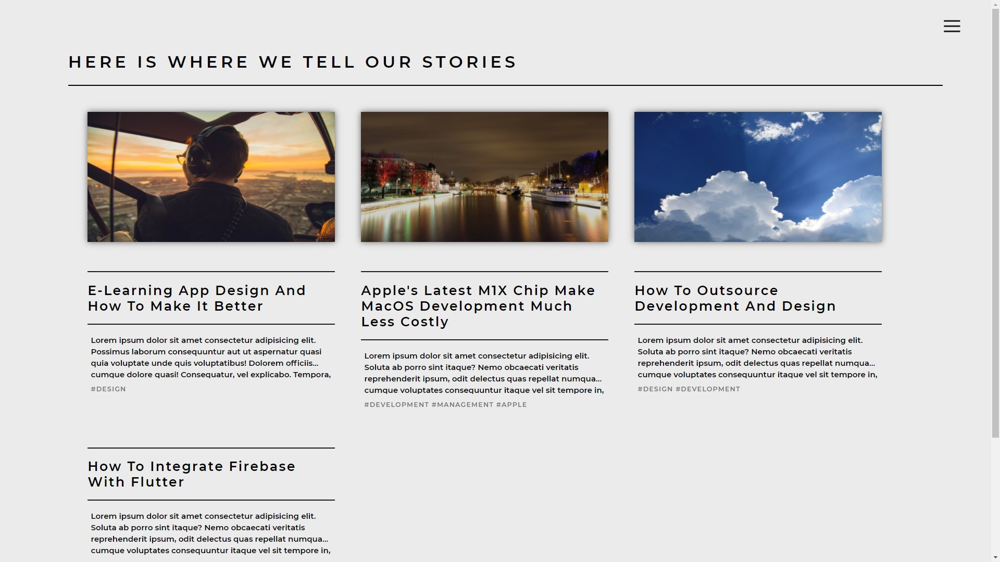
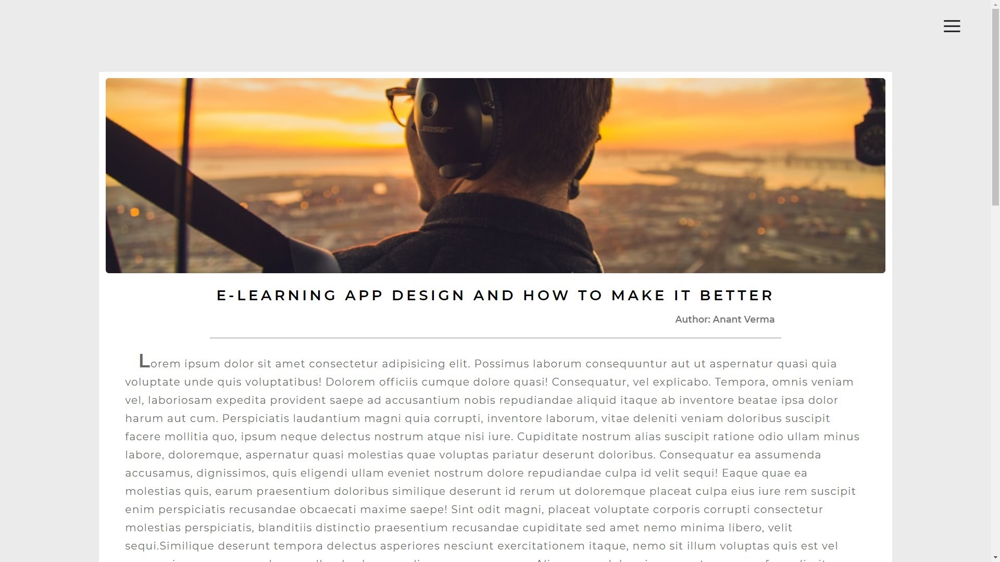
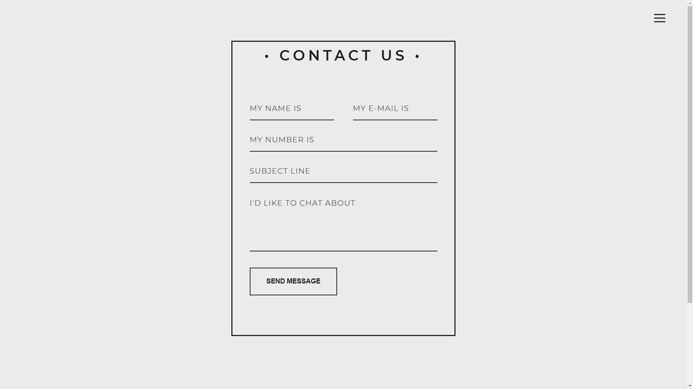
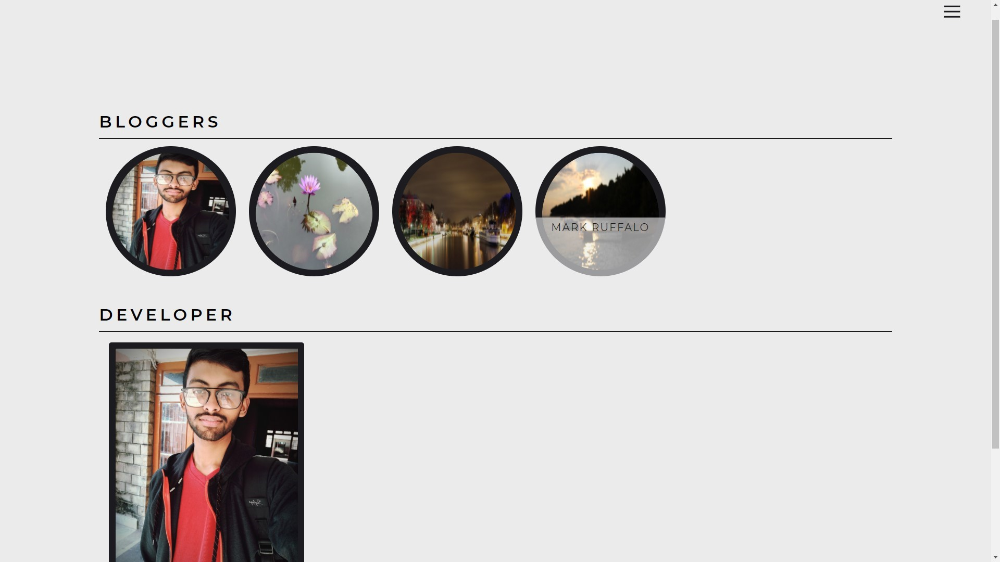
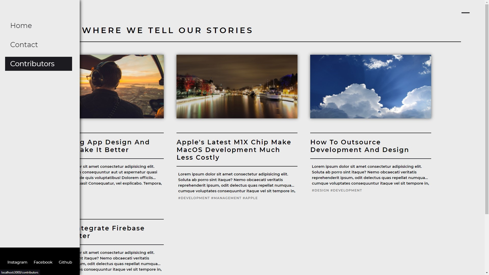

# Blog Post Web Application UI

<p align="center">


</p>

# UI Screenshots

## Home Screen



## Single Blog Post Screen



## Contact Us Screen



## Contributors Screen



## Sidebar



## Run Locally

Clone the project

```bash
  git clone https://github.com/abstrxtInfinity/    blog_webApplication.git
```

Go to the project directory

```bash
  cd my-project
```

Install dependencies

```bash
  npm install
```

Start the server

```bash
  npm start
```

This runs the app in the development mode.\
Open [http://localhost:3000](http://localhost:3000) to view it in the browser.
